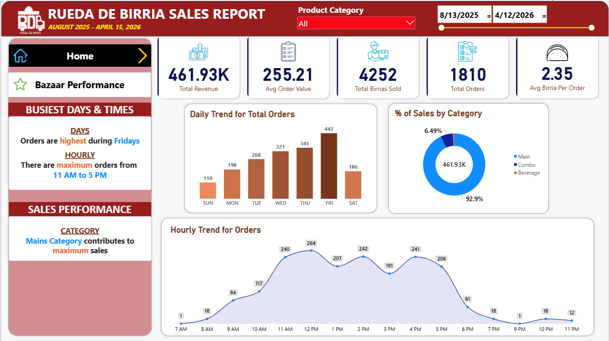
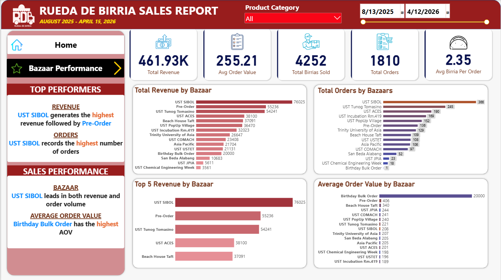

# Rueda de Birria Sales Performance Dashboard

## Project Overview

An interactive sales performance dashboard created for **Rueda de Birria (RDB)**, a small food business.

This project analyzes sales data from August 2025 to April 2026 to evaluate revenue, order volume, product category performance, selling periods, and bazaar performance. The dashboard transforms raw sales data into interactive visualizations that can be used to identify sales patterns and business opportunities.

## Tools Used

- **Microsoft Excel** – Data preparation and organization
- **SQL** – Data querying and analysis
- **Power BI** – Data visualization and dashboard development

## Project Objectives

The project aims to:

- Analyze overall sales performance
- Track total revenue and order volume
- Identify the best-performing product categories
- Analyze daily and hourly ordering patterns
- Compare revenue and order volume across bazaars
- Evaluate average order value across selling events
- Identify top-performing selling periods

## Dashboard

### Page 1 — Sales Overview

The Sales Overview page provides a high-level view of RDB's sales performance, including key performance indicators and ordering patterns.

**Key Metrics:**

- **Total Revenue:** ₱461.93K
- **Average Order Value:** ₱255.21
- **Total Birrias Sold:** 4,252
- **Total Orders:** 1,810
- **Average Birria per Order:** 2.35

**Key Findings:**

- Fridays recorded the highest number of orders.
- The highest order activity occurred between **11 AM and 5 PM**.
- The **Mains** category generated the majority of sales, accounting for approximately **92.9%** of total sales.

### Page 2 — Bazaar Performance

The Bazaar Performance page evaluates revenue, order volume, and average order value across different selling events and channels.

**Key Findings:**

- **UST SIBOL** generated the highest revenue at approximately **₱76.03K**.
- UST SIBOL also recorded the highest number of orders with **366 orders**.
- **Pre-Order** generated approximately **₱55.24K** in revenue.
- **UST Tunog Tomasino** generated approximately **₱54.24K** in revenue.
- **Birthday Bulk Order** recorded the highest average order value at **₱20,000**, although this was based on a single order.

## Business Insights

The analysis shows that RDB's sales performance is strongly influenced by **selling events, time of day, and product category**.

The concentration of orders during Fridays and between 11 AM and 5 PM suggests that these periods may be particularly important for inventory planning and staffing.

The dominance of the Mains category also indicates that the business's core products are the primary contributors to revenue.

Meanwhile, the Bazaar Performance analysis highlights which events generated the greatest revenue and order volume, providing useful information for evaluating future selling opportunities.

## Project Files

| File | Description |
|---|---|
| `RDB Sales Performance Analysis.pbix` | Power BI dashboard |
| `data/rdb_sales_data.csv` | Sales dataset used for the analysis |
| `SQL_queries.sql` | SQL queries used for data analysis |
| `dashboard_page1.png` | Sales Overview dashboard |
| `dashboard_page2.png` | Bazaar Performance dashboard |

## 💡 Skills Demonstrated

- Data cleaning and preparation
- SQL querying and aggregation
- Business data analysis
- KPI development
- Data visualization
- Dashboard design
- Sales performance analysis
- Business insight generation

## Project Author

**Carrey Nadine S. Magante**
